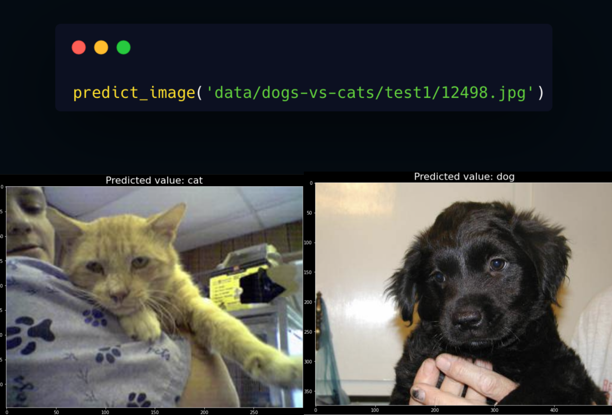
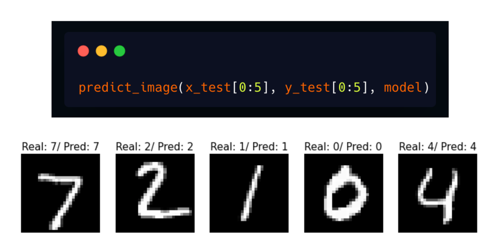

[//]: # (Remove the following line to remove the "Powered by EY" logo)

# Pyimg

[][pypi_]
[][status]
[][python version]
[][license]

[][read the docs]
[][tests]
[][codecov]

[][pre-commit]
[][black]

[pypi_]: https://pypi.org/project/pyimg/
[status]: https://pypi.org/project/pyimg/
[python version]: https://pypi.org/project/pyimg
[read the docs]: https://pyimg.readthedocs.io/
[tests]: https://github.com/ingwersen-erik/pyimg/actions?workflow=Tests
[codecov]: https://app.codecov.io/gh/ingwersen-erik/pyimg
[pre-commit]: https://github.com/pre-commit/pre-commit
[black]: https://github.com/psf/black

## Descrição

Guia introdutório sobre o uso de redes neurais convolucionais (CNNs) para classificação de
imagens.

O presente material foi dividido em notebooks, cada um apresentando uma arquitetura
específica para a solução de problemas ligados à classificação de imagens.

## Overview

|                  **Notebook**                   |                **Tipo de Problema**                |   **Arquitetura Rede Neural**   |                           **Base de Dados**                           |                    **Descrição**                     |
|:-----------------------------------------------:|:--------------------------------------------------:|:-------------------------------:|:---------------------------------------------------------------------:|:----------------------------------------------------:|
|       **EXEMPLO_01 - Cats vs Dogs.ipynb**       |         Problema de classificação binário.         | Rede neural convolucional (CNN) | [dogs-vs-cats](https://www.kaggle.com/competitions/dogs-vs-cats/data) |   Modelo classifica imagens de cachorros e gatos.    |
|    **EXEMPLO_02 - MNIST Feed-Forward.ipynb**    |      Problema de classificação multi-classe.       |   Rede neural fully connected   |          [MNIST Dataset](http://yann.lecun.com/exdb/mnist/)           | Modelo classifica imagens de dígitos escritos à mão. |
|      **EXEMPLO_03 - MNIST ConvNet.ipynb**       |      Problema de classificação multi-classe.       | Rede neural convolucional (CNN) |          [MNIST Dataset](http://yann.lecun.com/exdb/mnist/)           | Modelo classifica imagens de dígitos escritos à mão. |
| **EXEMPLO_04 - MNIST Vision Transformer.ipynb** |      Problema de classificação multi-classe.       |    Vision Transformer (ViT)     |          [MNIST Dataset](http://yann.lecun.com/exdb/mnist/)           | Modelo classifica imagens de dígitos escritos à mão. |
|     **EXTRA - ATARI DEEP-Q LEARNING.ipynb**     | Aprendizado por reforço ? (Reinforcement Learning) | Rede neural convolucional (CNN) |                                  N/A                                  |        Modelo aprende a jogar ATARI sozinho.         |

----

### EXEMPLO_01 - Cats vs Dogs.ipynb

### EXEMPLO_02 - MNIST Feed-Forward.ipynb

### EXTRA - ATARI DEEP-Q LEARNING.ipynb

<!-- github-only -->

[license]: https://github.com/ingwersen-erik/pyimg/blob/main/LICENSE
[contributor guide]: https://github.com/ingwersen-erik/pyimg/blob/main/CONTRIBUTING.md
[command-line reference]: https://pyimg.readthedocs.io/en/latest/usage.html
